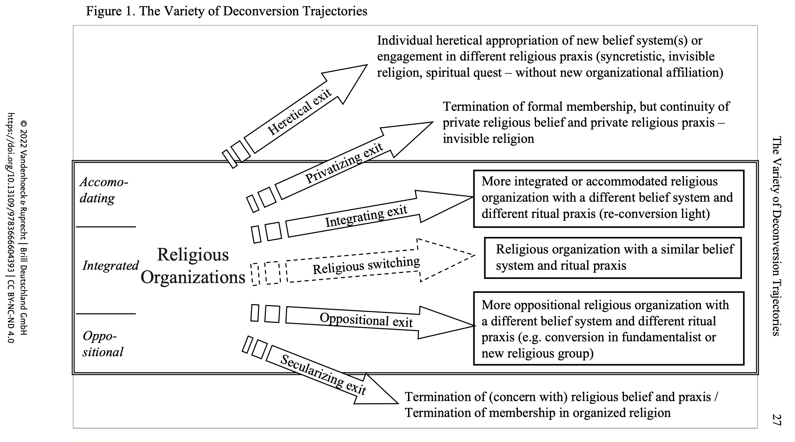

# Interkulturelle Kommunikationswege   

### in sich wandelnden religiösen Umfeldern

### 11. Radikalisierung

Sommersemester 2024  
Prof. Dr. Nathan Gibson

## Mündliche Prüfungen & Hausarbeiten

Anmeldung jetzt geschlossen. (Ausnahme: Sie sprechen heute mit mir.)

## 📈 Rückblick: Aufrechterhaltung & Dekonversion

🧭 Die Faktoren vergleichen, die für den Verbleib in einer Religion und den Austritt aus ihr sprechen.

## 📈 Rückblick: Aufrechterhaltung

1. Podcast: Die Rolle von Praktiken, Gemeinschaft, Glaubensinhalten
2. Lektüre: Initiationsriten

## 📈 Rückblick Diskussion: Aufrechterhaltung & Dekonversion

- Die persönliche Seite der Religionswissenschaft
  - Neutral und objektiv bleiben?
  - Eigene Perspektive anerkennen?

## 📈 Rückblick: Dekonversion

## Lernziel

🧭 Radikalisierung erkennen und ihre Wurzeln in der Kommunikation berücksichtigen können.

## Intro

<iframe src="https://ars.particify.de/p/55069903/series/11-Radikalisierung" width="100%" height="100%" class="r-stretch"/>

## Podcast

## Vorschau

- Besuch: Sabine Ahmadzai über Konversionsnarrativen
- Rückblick vom Seminar
- Lehrevaluation